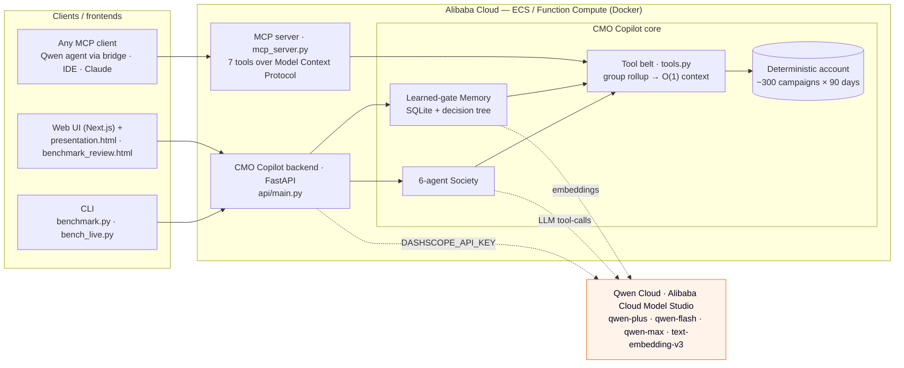
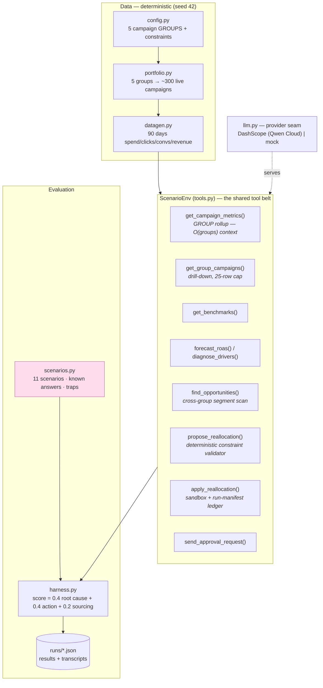
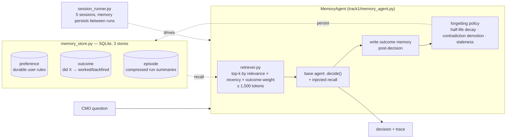
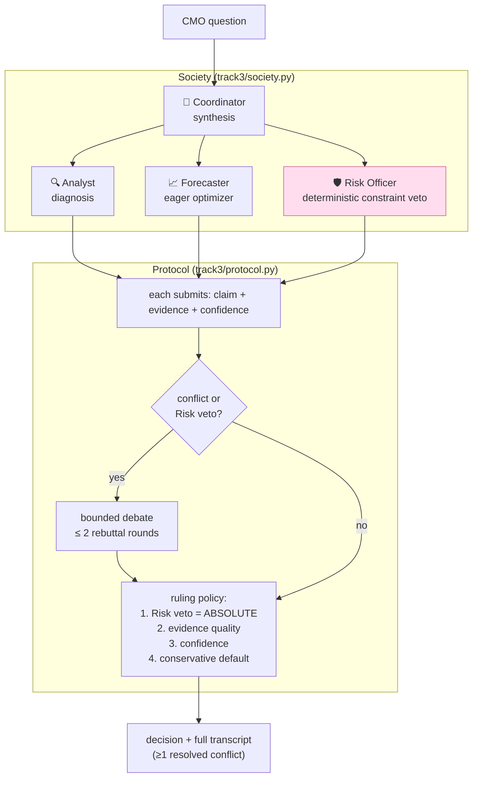
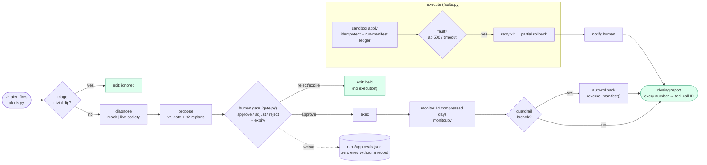
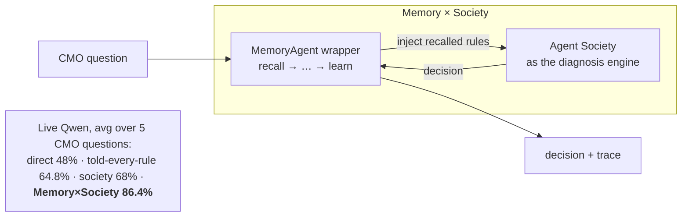
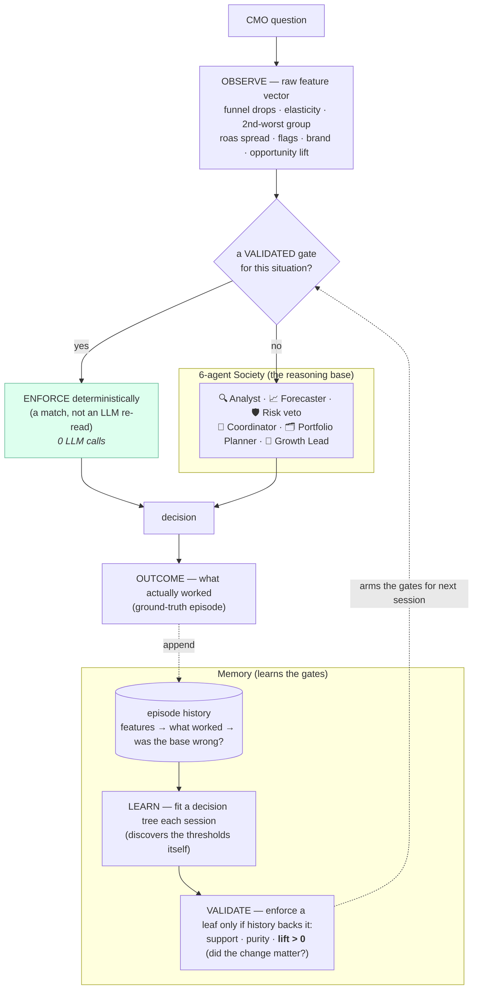

# Architecture — One Problem, Three Architectures

Diagrams render natively on GitHub (Mermaid). One CMO decision — *"ROAS dropped this
week; where should the budget go?"* — solved three ways on **one shared foundation**,
so every score delta is architectural, not data or model luck.

**Model:** Qwen (Qwen3-235B / `qwen-plus` / `qwen-flash` / `qwen-max`) served from
**Alibaba Cloud Model Studio (DashScope)** via a single provider seam (`llm.py` +
`config.py`, `LLM_PROVIDER=dashscope`). Every component also runs in a deterministic
`--mock` mode for offline CI.

---

## System / deployment topology — how Qwen Cloud connects to the backend & clients

The **backend (FastAPI)** and the **MCP server** run on **Alibaba Cloud**; both call **Qwen on
Alibaba Cloud Model Studio** (chat models + embeddings) through the provider seam. Clients — the
CLI, the web UI, or any MCP client — reach the same audited, group-rollup tool belt. *(This is
the diagram to screenshot for the Devpost "Architecture Diagram" field.)*

---

## 0. Shared foundation

The reusable substrate all three tracks are built on: same data, same tool belt, same
scorer.

**Why the group/campaign split matters (the scaling story).** A VP-Growth reasons about
**5 groups**, not 300 campaigns. `get_campaign_metrics` rolls up to group level (~5 rows,
~500 tokens) *no matter how many campaigns sit underneath*; `get_group_campaigns` drills
down only on request, hard-capped at 25 rows. Dumping the whole account is O(N) in tokens
and **blows the 32k context window around 500–1,000 campaigns** (measured in
`runs/scaling.json`) — this architecture keeps context ~O(1).

---

## 1. Track 1 — MemoryAgent

The same agent gets measurably better across sessions: it recalls corrections and the
outcomes of its own past decisions, under a hard context budget, with a real forgetting
policy.

**Money-shot:** the accuracy-over-sessions curve climbing (mock: **4.8 → 10.8 / 11**)
while the baseline stays flat at 4.8 and tokens/decision stay bounded.

---

## 2. Track 3 — Agent Society

Four specialists argue under a structured protocol; a deterministic Risk veto and a coded
ruling policy resolve conflicts. Every decision writes a full transcript.

**Money-shot:** the **S07** transcript — Forecaster wants to cut the brand campaign, the
**Risk Officer vetoes** ("would breach the $2,000 brand floor"), the Coordinator holds.
Mock: **9.0 / 11 vs 4.8 baseline (+4.2)**, solves all three traps.

---

## 3. Track 4 — Autopilot

No one asks the agent anything: an alert fires and the pipeline carries the work to a
sandboxed execution, pausing only at a human gate. Every terminal state is safe.

**Money-shot:** the rehearsed failure — inject `api500` mid-execution → retry → partial
rollback → human notification → terminal state **`failed_safe`**. Mock: **11/11 end safe**,
5 execute, 1 auto-rolls-back, **zero unapproved executions**.

---

## 4. Composite — Memory × Society (the headline)

The layers compose: the society does the hard diagnosis; memory *enforces* recalled rules
and *corrects* the situations that backfired before.

> **The takeaway:** a smart model is table stakes. The measurable wins come from
> architecture — a deterministic policy gate, a specialist society, and memory that
> corrects recurring mistakes — and those layers compose. Same model throughout.

_(Live percentages are from the head-to-head benchmark; see `SUBMISSION.md` and
`runs/` for the sourced numbers.)_

---

## 5. Society + Memory — the memory that *learns* which calls to override

The converged architecture (`track3/society.py` + `track1/memory_gates.py`). The 6-agent
society reasons; the memory learns, from experience, which of its calls to override — validates
the override *mattered* on history, and enforces it deterministically. **74% → 100% over four
sessions, stable, zero LLM calls at enforcement.**

**Why it's stable where prose-memory wasn't:** the tree learns from the *fixed ground-truth
outcomes*, not a fuzzy note the LLM re-interprets — so application is noise-free, and a leaf
can't drift on one anecdote (it needs historical support + lift to fire). The learned tree is
**identical across a deterministic base and a live-Qwen base**, because it's learning the
*task's* structure, not the base's quirks.

> **The takeaway:** a specialist society reasons; a memory learns *which of its calls to
> override* — from experience, validated against its own history, enforced deterministically.
> 27% → 100% on the same benchmark, and it holds.
